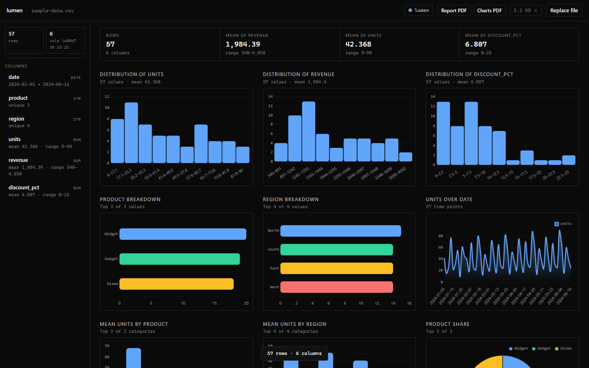

<p align="center">
  
</p>

<h1 align="center">Lumen</h1>
<p align="center">Your data, instantly.</p>

<p align="center">
  <a href="LICENSE"></a>
  <a href="#quick-start"></a>
  <a href="#technology-stack"></a>
  <a href="#technology-stack"></a>
</p>

<p align="center">
  <video src="public/demo.mp4" width="800" autoplay muted loop playsinline controls>
    
  </video>
</p>

---

Lumen is a data exploration tool that runs entirely in your browser. Drop in a file. Charts, statistics, search — all rendered locally. Nothing leaves your machine.

<p align="center">
  
</p>

---

## What it does

**Open any data file.** CSV, TSV, TXT, or JSON. Lumen detects the structure and builds a dashboard around it. No configuration. No setup.

**Or open a folder.** Browse every compatible file in a directory. Switch between them instantly. Lumen remembers your recent folders.

**See everything at a glance.** Every column is classified and profiled — numeric distributions, date ranges, category frequencies, null counts. Charts render automatically based on what the data actually contains.

**Search across everything.** Type a value and Lumen scans every column, every row. Results appear instantly. Matches highlight in the data table. Navigate with arrow keys, close with Escape.

**Make it yours.** Six themes. Keyboard shortcuts. Fullscreen charts with scroll-to-zoom. Install it as a desktop app.

---

## Charts

Lumen selects the right visualization for each column automatically.

| Data type | Visualization |
|---|---|
| Numeric | Histogram with 10 equal-width bins |
| Text (categorical) | Horizontal bar chart of top values |
| Date &middot; Numeric | Time-series line chart |
| Category &middot; Numeric | Vertical bar of averages |
| Top text column | Proportional doughnut |

Charts use the active theme's color palette and update immediately when you switch themes.

---

## Themes

Six looks. Instant switching.

| Theme | Shortcut | Appearance |
|---|---|---|
| Midnight | `Ctrl+1` | Dark, cool blue accents |
| Graphite | `Ctrl+2` | Restrained grayscale |
| Paper | `Ctrl+3` | Full light mode |
| Ember | `Ctrl+4` | Warm amber and orange |
| Auto | `Ctrl+0` | Matches your system setting |
| Custom | — | Pick any accent color; Lumen builds the rest |

Smooth 0.3s transitions. Preference saved locally.

---

## Quick Start

Requires Node.js 18 or later.

```bash
npm install
npm run dev
```

Open `http://localhost:5173`. Drop `sample-data.csv` onto the window, or browse any supported file.

```bash
npm run build
npm run preview    # production build at http://localhost:4173
```

---

## File formats

| Format | Notes |
|---|---|
| `.csv` | Comma-separated values |
| `.tsv` | Tab-separated values |
| `.txt` | Delimiter auto-detected |
| `.json` | Array of objects, or `{ "rows" \| "data": […] }` |

`sample-data.csv` is included for immediate testing — 60 rows of fictional sales data.

---

## Architecture

```
src/
├── App.tsx                    # Application shell and state
├── main.tsx                   # Entry point
├── lib/
│   └── chartSetup.ts          # Chart.js configuration and zoom
├── utils/
│   ├── fileParser.ts          # File parsing and lightweight preview
│   ├── columnAnalyzer.ts      # Type inference and statistics
│   ├── themes.ts              # Theme definitions and palette generation
│   └── useTheme.tsx           # Theme context and persistence
├── components/
│   ├── FileUpload.tsx         # Drag-and-drop and folder selection
│   ├── FolderView.tsx         # Directory file browser with previews
│   ├── DataOutline.tsx        # Column sidebar
│   ├── StatsCards.tsx         # Summary statistics
│   ├── ChartsPanel.tsx        # Chart grid and fullscreen overlay
│   ├── HistogramChart.tsx     # Numeric distribution
│   ├── CategoryBarChart.tsx   # Categorical breakdown
│   ├── MetricBarChart.tsx     # Aggregated bar chart
│   ├── MetricLineChart.tsx    # Time-series line chart
│   ├── MetricDoughnut.tsx     # Proportional doughnut
│   ├── DataPreview.tsx        # Data table with search highlighting
│   ├── SearchBar.tsx          # Global search with dropdown
│   └── ThemePicker.tsx        # Theme selection popover
└── styles/
    └── glass.css              # Design system and layout

public/
├── icon.svg                   # Brand mark and favicon
└── screenshot.png             # Dashboard capture

scripts/
├── screenshot.mjs             # Automated screenshot capture
└── record-demo.mjs            # Demo video recording
```

---

## Built with

| | |
|---|---|
| Build | [Vite 5](https://vitejs.dev) |
| Framework | [React 18](https://react.dev) with [TypeScript 5](https://www.typescriptlang.org/) |
| Charts | [Chart.js 4](https://www.chartjs.org) via [react-chartjs-2](https://react-chartjs-2.js.org/) |
| Zoom | [chartjs-plugin-zoom](https://www.chartjs.org/chartjs-plugin-zoom/) |
| Parsing | [PapaParse 5](https://www.papaparse.com) |
| File input | [react-dropzone 14](https://react-dropzone.js.org) |
| PWA | [vite-plugin-pwa](https://vite-pwa-org.netlify.app) |
| Styling | Custom properties. No framework. |

---

## Deploy

### GitHub Pages

1. Repository **Settings → Pages** → source: **GitHub Actions**
2. Push to `main`

Deploys to `https://<owner>.github.io/<repo>/`.

### Install as a desktop app

Open the deployed URL in Chrome or Edge. Click the install icon in the address bar. The app runs standalone with offline support via service worker.

### Native binary (Tauri)

Requires [Rust](https://rustup.rs) and [Tauri prerequisites](https://tauri.app/start/prerequisites/).

```bash
npm install --save-dev @tauri-apps/cli@latest
npx tauri init
npm run tauri build
```

---

## Development

```bash
npm run dev          # Dev server with hot reload
npm run build        # Production build
npm run preview      # Preview production build
npx tsc -b --noEmit  # Type check
```

---

## License

[MIT](LICENSE) &copy; 2026 Jeremy
